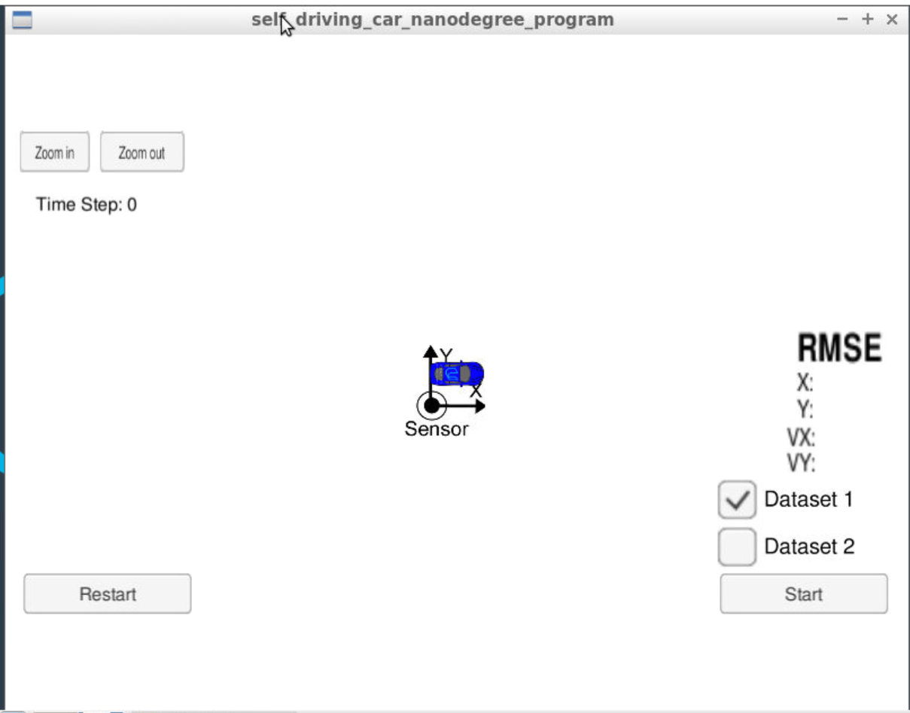
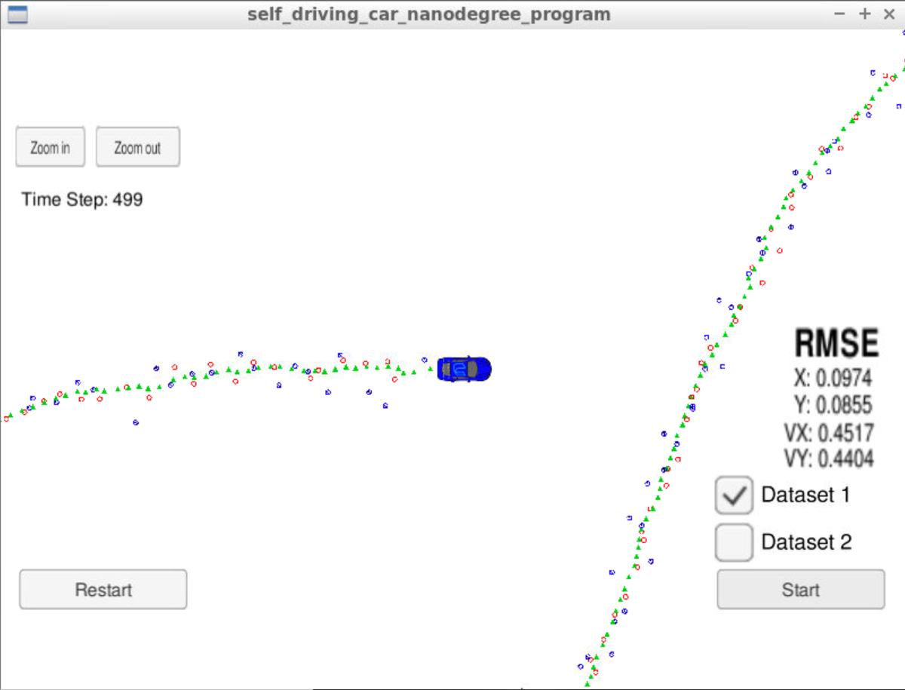

# CarND-Extended-Kalman-Filter-P1
Udacity Self-Driving Car Nanodegree - Extended Kalman Filter Implementation

# Overview
This project consists of implementing an Extended Kalman Filter with C++. A simulator provided by Udacity generates noisy RADAR and LIDAR measurements of the position and velocity of an object, and the Extended Kalman Filter must fusion those measurements to predict the position of the object.

I used the workspace provided by Udacity, which makes environment configuration much easier.

# Compiling and executing the project

These are the suggested steps:

- `cd` into the folder.
- Setup necessary utilites by running `./install-%your platform%.sh`
- Create the build directory: `mkdir build`
- Enter the build folder `cd build`
- Run make `cmake .. && make`
- `make`: This will create `ExtendedKF` executables

## Running the Filter

From the build directory, execute `./ExtendedKF`. The output should something like:

```
Listening to port 4567
Connected!!!
```

Launch the simulator, which connect to the `./ExtendedKF` executable right away. Select the DataSet1 or DataSet2 in the simulator, and press Start. You will see the car running, and the RMSE of X, Y, VX, VY decreases as the car runs.

The following is an image of the simulator:



Here is the simulator final state after running the EKL with dataset 1:



Here is the simulator final state after running the EKL with dataset 2:


# Rubric

## Compiling

### Your code should compile

The code compiles without errors.

## Accuracy

### px, py, vx, vy output coordinates must have an RMSE <= [.11, .11, 0.52, 0.52] when using the file: "obj_pose-laser-radar-synthetic-input.txt which is the same data file the simulator uses for Dataset 1"

The EKF accuracy was:

- Dataset 1 : RMSE <= [0.0974, 0.0855, 0.4517, 0.4404]
- Dataset 2 : RMSE <= [0.0726, 0.0967, 0.4579, 0.4966]

## Following the Correct Algorithm

### Your Sensor Fusion algorithm follows the general processing flow as taught in the preceding lessons.

The Kalman filter implementation can be found [src/kalman_filter.cpp](./src/kalman_filter.cpp) and it is used to predict and update at [src/FusionEKF.cpp](./src/kalman_filter.cpp).

### Your Kalman Filter algorithm handles the first measurements appropriately.

The first measurement is handled at [src/FusionEKF.cpp](./src/kalman_filter.cpp#L49).

### Your Kalman Filter algorithm first predicts then updates.

Both could be found at [src/FusionEKF.cpp](./src/kalman_filter.cpp)
Prediction is in line 109, and update happens in line 125 (for Radar) and line 131 (for Lidar).

### Your Kalman Filter can handle radar and lidar measurements.

Different type of measurements are handled in two places in [src/FusionEKF.cpp](./src/kalman_filter.cpp) 
Line 115 for Radar and line 126 for Lidar.

## Code Efficiency

### Your algorithm should avoid unnecessary calculations.
For complex matrix calculation (for example, matrix transpose), I stored the result in an variable if the result is used more than once. This is shown in [src/FusionEKF.cpp](./src/kalman_filter.cpp)
